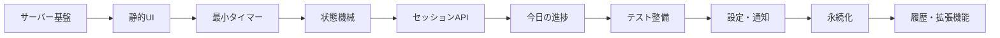

# ポモドーロタイマー実装計画

## 目的

画像にあるポモドーロタイマー画面を起点に、タイマー、セッション記録、今日の進捗表示を段階的に実装する。

タイマーの進行はブラウザ側で完結させ、Goサーバーは完了したセッションの記録と集計を担当する。

## 実装方針

- 1つのフェーズを、ブラウザまたはテストで動作確認できる大きさにする
- タイマーの状態管理、画面描画、API通信、サーバー処理を分離する
- まずインメモリ保存で動作を確認し、永続化は後から追加する
- 各フェーズの完了時にテストを追加し、次のフェーズの前提を固定する
- 画像にあるUIを早い段階で表示し、見た目と動作を段階的に一致させる

## 全体ロードマップ



## フェーズ1: Goサーバーと静的ファイル配信

### 目的

ブラウザからアプリケーションを開ける最小の実行基盤を作る。

### 実装内容

- [ ] `net/http` でサーバーを起動する
- [ ] `/` のルーティングを登録する
- [ ] `static/` 配下のHTML、CSS、JavaScriptを配信する
- [ ] `go:embed` で静的ファイルを埋め込む
- [ ] API用のルーティング領域を確保する

### 想定ファイル

```text
pomodoro/
  main.go
  static/
    index.html
    style.css
    js/
      app.js
```

### 完了条件

- [ ] `cd pomodoro && go run .` で起動できる
- [ ] ブラウザで `http://localhost:8080` を開ける
- [ ] HTML、CSS、JavaScriptが正しく読み込まれる
- [ ] `go test ./...` が実行できる

## フェーズ2: 画像に合わせた静的UI

### 目的

タイマーを動かさず、添付画像の主要な画面構成を再現する。

### 実装内容

- [ ] 紫系の背景を作る
- [ ] 白いメインパネルを作る
- [ ] タイトルを表示する
- [ ] 現在のモード「作業中」を表示する
- [ ] 円形プログレスを表示する
- [ ] 中央に `25:00` を表示する
- [ ] 「開始」ボタンを表示する
- [ ] 「リセット」ボタンを表示する
- [ ] 「今日の進捗」パネルを表示する
- [ ] 完了回数と集中時間を仮データで表示する
- [ ] モバイル幅でもレイアウトが崩れないようにする

### 想定ファイル

```text
static/
  index.html
  style.css
  js/
    format.js
```

### 完了条件

- [ ] 画像にある主要要素が表示される
- [ ] 円形プログレスが表示される
- [ ] ボタンのフォーカス状態が確認できる
- [ ] デスクトップとモバイルで表示が崩れない
- [ ] `format.js` がDOMに依存していない

## フェーズ3: 最小タイマー

### 目的

作業時間だけを対象に、開始、一時停止、再開、リセットを実装する。

### 実装内容

- [ ] `idle`、`running`、`paused` の状態を定義する
- [ ] タイマーを開始する
- [ ] タイマーを一時停止する
- [ ] 一時停止したタイマーを再開する
- [ ] タイマーをリセットする
- [ ] 残り時間をカウントダウンする
- [ ] 残り時間を画面に反映する
- [ ] 円形プログレスを残り時間に同期する
- [ ] 状態に応じてボタン表示を切り替える

### 責務分担

#### `pomodoroEngine.js`

- 状態を管理する
- 残り秒数を管理する
- 開始、一時停止、再開、リセットを処理する
- `tick(deltaSec)` で時間を進める
- DOMを直接操作しない

#### `view.js`

- タイマー状態をDOMへ反映する
- 残り時間を表示する
- 円形プログレスを更新する
- ボタンの表示と有効状態を更新する

#### `app.js`

- エンジンとビューを生成する
- ボタンイベントを登録する
- タイマーの更新処理を開始する

### 完了条件

- [ ] 「開始」でカウントダウンが始まる
- [ ] 「一時停止」で時間が止まる
- [ ] 「再開」で続きから動く
- [ ] 「リセット」で初期値に戻る
- [ ] タイマーのロジックがDOMなしでテストできる

## フェーズ4: ポモドーロ状態機械

### 目的

作業と休憩を含むポモドーロのサイクルを完成させる。

### 実装内容

- [ ] 作業モードを定義する
- [ ] 短い休憩モードを定義する
- [ ] 長い休憩モードを定義する
- [ ] 作業完了時に作業回数を増やす
- [ ] 作業終了後に短い休憩へ切り替える
- [ ] 規定回数の作業後に長い休憩へ切り替える
- [ ] 休憩終了後に次の作業へ切り替える
- [ ] セッション完了時に画面上で通知する
- [ ] ブラウザが非アクティブでも経過時間を正しく扱う

### 初期設定

```text
作業時間: 25分
短い休憩: 5分
長い休憩: 15分
長い休憩へ切り替える回数: 4回
```

テストでは短い時間を注入できるようにし、実際に25分待たなくても状態遷移を検証できるようにする。

### 完了条件

- [ ] 作業から短い休憩へ切り替わる
- [ ] 規定回数後に長い休憩へ切り替わる
- [ ] 休憩から作業へ切り替わる
- [ ] 作業回数が正しく管理される
- [ ] `tick(deltaSec)` で時間経過を決定的に検証できる

## フェーズ5: セッション記録API

### 目的

完了した作業・休憩セッションをGoサーバーへ記録する。

### 実装内容

- [ ] `Session` モデルを定義する
- [ ] `SessionStore` インターフェースを定義する
- [ ] インメモリストアを実装する
- [ ] `POST /api/sessions` を実装する
- [ ] JSONリクエストを解析する
- [ ] セッション種別を検証する
- [ ] セッション時間を検証する
- [ ] 完了日時を検証する
- [ ] 不正なリクエストに `400 Bad Request` を返す
- [ ] 内部エラーに `500 Internal Server Error` を返す

### 記録データ

```json
{
  "type": "work",
  "durationSec": 1500,
  "completedAt": "2026-09-08T10:00:00+09:00"
}
```

### 想定ファイル

```text
internal/
  domain/
    session.go
  storage/
    memory_store.go
  handler/
    session_handler.go
  clock/
    clock.go
```

### 完了条件

- [ ] 正しいリクエストを保存できる
- [ ] 不正なJSONを拒否できる
- [ ] 不正なセッション種別を拒否できる
- [ ] 負の時間や異常に長い時間を拒否できる
- [ ] `httptest` でハンドラを検証できる

## フェーズ6: 今日の進捗APIと画面連携

### 目的

画像下部の「今日の進捗」を実際のセッションデータに接続する。

### 実装内容

- [ ] 今日完了した作業セッション数を集計する
- [ ] 今日の集中時間合計を集計する
- [ ] `GET /api/stats/today` を実装する
- [ ] `api.js` から今日の統計を取得する
- [ ] ページ読み込み時に統計を表示する
- [ ] 作業完了後にセッションを送信する
- [ ] 作業完了後に統計を更新する
- [ ] APIエラーを画面に表示する
- [ ] API失敗時もタイマーを停止しない

### データフロー

```text
ページ読み込み
  -> GET /api/stats/today
  -> 進捗を表示

作業セッション完了
  -> POST /api/sessions
  -> GET /api/stats/today
  -> 進捗を更新
```

### 完了条件

- [ ] 保存済みの作業回数が画面に表示される
- [ ] 集中時間が画面に表示される
- [ ] 作業完了後に進捗が増える
- [ ] 日付境界を考慮して今日を判定できる
- [ ] `GET /api/stats/today` をテストできる

## フェーズ7: テスト整備

### 目的

これまでのタイマー、集計、APIを自動テストで固定する。

### JavaScript

- [ ] 初期状態をテストする
- [ ] 開始をテストする
- [ ] 一時停止をテストする
- [ ] 再開をテストする
- [ ] リセットをテストする
- [ ] `tick(deltaSec)` をテストする
- [ ] 作業終了をテストする
- [ ] 休憩への遷移をテストする
- [ ] 長い休憩への遷移をテストする
- [ ] `mm:ss` 変換をテストする
- [ ] 円形プログレスの計算をテストする
- [ ] 不正な操作を拒否することをテストする

### Go

- [ ] セッションのバリデーションをテストする
- [ ] セッション保存をテストする
- [ ] 今日の集計をテストする
- [ ] 日付境界をテストする
- [ ] `POST /api/sessions` の正常系をテストする
- [ ] 不正なリクエストをテストする
- [ ] `GET /api/stats/today` をテストする
- [ ] 空のストアをテストする
- [ ] ストレージエラーをテストする

### 完了条件

```bash
cd pomodoro
go test ./...
node --test static/js/*.test.js
```

上記のテストが成功する。

## フェーズ8: 設定と通知

### 目的

実際の利用時にタイマーを調整しやすくする。

### 実装内容

- [ ] 作業時間を変更できるようにする
- [ ] 短い休憩時間を変更できるようにする
- [ ] 長い休憩時間を変更できるようにする
- [ ] 長い休憩へ切り替える回数を変更できるようにする
- [ ] 設定を `localStorage` に保存する
- [ ] 起動時に設定を読み込む
- [ ] 設定を初期値に戻す
- [ ] 通知音を追加する
- [ ] ブラウザ通知に対応する
- [ ] 自動的に次のセッションを開始する設定を追加する
- [ ] キーボード操作に対応する

### 実装順

1. 状態機械が設定値を受け取れるようにする
2. 設定画面を追加する
3. `localStorage` へ保存する
4. 通知音を追加する
5. ブラウザ通知を追加する
6. 自動開始を追加する

## フェーズ9: セッションの永続化

### 目的

アプリケーション再起動後もセッション記録を保持する。

### 実装内容

- [ ] JSONファイルへの保存を実装する
- [ ] 起動時にデータを復元する
- [ ] 保存時の排他制御を行う
- [ ] データ破損時のエラー処理を行う
- [ ] `SessionStore` インターフェースを維持したまま保存先を変更する

### 実装方針

```text
MemorySessionStore
FileSessionStore
```

インメモリ実装とファイル実装を差し替えられるようにし、APIハンドラや集計ロジックの変更を最小限にする。

## フェーズ10: 履歴と拡張機能

### 履歴と統計

- [ ] 過去の日別履歴を表示する
- [ ] 週単位の統計を表示する
- [ ] 月単位の統計を表示する
- [ ] 集中時間の推移を表示する
- [ ] セッション履歴を削除する
- [ ] 統計データをエクスポートする

### タスク管理

- [ ] セッションにタスク名を付ける
- [ ] セッションにメモを付ける
- [ ] タスクごとの集中時間を集計する
- [ ] タスク一覧を表示する

### データベースと複数ユーザー

- [ ] SQLiteなどのデータベースに対応する
- [ ] ユーザー登録に対応する
- [ ] ログインとログアウトに対応する
- [ ] ユーザーごとにセッションを分離する
- [ ] 認証済みAPIを実装する

### オフライン対応

- [ ] オフライン中もタイマーを利用できるようにする
- [ ] 未送信セッションを一時保存する
- [ ] オンライン復帰後にセッションを同期する
- [ ] PWA化する

## フェーズの完了基準

各フェーズは、次の条件を満たした時点で完了とする。

- [ ] 実装対象が動作する
- [ ] 変更した責務のテストがある
- [ ] 既存のテストが成功する
- [ ] ブラウザで確認できる機能は実際に確認する
- [ ] 次のフェーズに必要なインターフェースが安定している

## 推奨する最初のマイルストーン

まずは次の4フェーズを一つのマイルストーンとして実装する。

1. Goサーバーを起動して画面を表示する
2. 添付画像のUIを再現する
3. 25分タイマーを開始・停止・リセットできるようにする
4. 作業と休憩の状態遷移を動かす

この時点で、画面とタイマーのコア動作を確認できる。

## 推奨する次のマイルストーン

次に、バックエンドとの連携を完成させる。

1. `POST /api/sessions` を実装する
2. `GET /api/stats/today` を実装する
3. 今日の進捗カードをAPIと接続する
4. GoとJavaScriptのテストを整備する

この時点で、タイマーを使って作業し、完了回数と集中時間を確認できる最小のアプリケーションになる。

## 作業単位の目安

1つの作業単位は、次の条件を満たす大きさにする。

- 変更する責務が1つか2つに収まる
- 数時間程度で実装できる
- ブラウザまたはテストで結果を確認できる
- 失敗した場合に原因を特定しやすい
- 次の作業がなくても部分的に動作する

### 適切な粒度の例

- 残り秒数を `mm:ss` に変換する
- タイマーを開始・停止できるようにする
- 円形プログレスを残り時間に同期する
- セッションをPOSTできるようにする
- 今日の作業回数を集計する

### 大きすぎる作業単位の例

- タイマー機能を実装する
- APIを実装する
- 画面を完成させる
