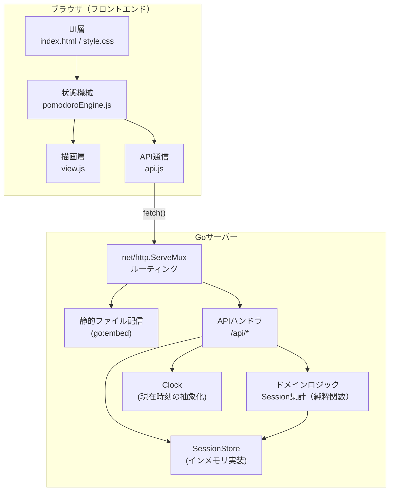

# ポモドーロタイマー Webアプリ アーキテクチャ案

## 概要

Go の `net/http` をバックエンドに、HTML/CSS/JavaScript をフロントエンドに用いたポモドーロタイマーアプリのアーキテクチャ案。タイマー自体の進行はクライアント（ブラウザ）側で完結させ、サーバーは「今日の進捗（完了回数・集中時間合計）」の記録・集計に専念する役割分担とする。

## 全体構成



## ディレクトリ構成

```
pomodoro/
  go.mod
  main.go                     # サーバー起動・ルーティング登録・依存注入
  internal/
    clock/
      clock.go                # Clock interface + 実装（本番/テスト用フェイク）
    domain/
      session.go              # Session, Stats モデルと集計の純粋関数
    handler/
      session_handler.go      # POST /api/sessions
      stats_handler.go        # GET /api/stats/today
    storage/
      memory_store.go         # SessionStore interface + インメモリ実装
  static/
    index.html
    style.css
    js/
      app.js                  # エントリーポイント（Engine/View/APIを結線）
      pomodoroEngine.js        # DOM非依存の状態機械（idle/running/paused, work/break）
      view.js                  # DOM描画のみ（円グラフ・ボタン・テキスト更新）
      api.js                   # サーバーAPI呼び出し
      format.js                # mm:ss変換・円弧角度計算などの純粋関数
      pomodoroEngine.test.js
      format.test.js
```

## 責務分担

### バックエンド（Go）

- **`main.go`**: 依存関係（Store・Clock）を生成し、ハンドラへコンストラクタ注入した上で `net/http.ServeMux` にルーティング登録する。静的ファイルは `go:embed` で埋め込み、単一バイナリで配布可能にする。
- **`internal/handler`**: リクエストのパースとレスポンス整形のみを行う薄い層。ビジネスロジックは持たない。
- **`internal/domain`**: 「セッション一覧から今日の完了回数・合計時間を計算する」などの純粋関数を提供する。HTTPやストレージに依存しない。
- **`internal/storage`**: `SessionStore` インターフェースとインメモリ実装。将来的にファイル永続化やDBへの差し替えが可能。
- **`internal/clock`**: `time.Now()` を直接呼ばず `Clock` インターフェース経由で取得することで、日付境界などのテストを決定的にする。

### フロントエンド（JS）

- **`pomodoroEngine.js`**: 状態（`idle`/`running`/`paused`、`work`/`break`、残り秒数）と遷移ルールを持つ、DOMに依存しないクラス。時間経過は `tick(deltaSec)` のように明示的に注入できるAPIとする。
- **`view.js`**: `pomodoroEngine` の状態を受け取り、円グラフ・ボタン・テキストなどのDOMへ反映するだけの層。
- **`format.js`**: 残り秒数→`mm:ss`表示、残り秒数→円弧の `stroke-dasharray`/角度への変換などの純粋関数。
- **`api.js`**: `/api/sessions` へのPOST、`/api/stats/today` へのGETなど、サーバー通信を担当。
- **`app.js`**: 上記を結線するエントリーポイント。

## API設計

| メソッド | パス | 用途 |
|---|---|---|
| `GET` | `/api/stats/today` | 今日の完了回数・集中時間合計を取得 |
| `POST` | `/api/sessions` | 1セッション（作業/休憩）の完了を記録 |

`POST /api/sessions` リクエスト例:

```json
{ "type": "work", "durationSec": 1500, "completedAt": "2026-09-08T10:00:00+09:00" }
```

## テスト容易性のための設計方針

- **Go**: `SessionStore` と `Clock` をインターフェース化し、ハンドラへコンストラクタ注入する。ハンドラのテストは `httptest` を用い、集計ロジック（`internal/domain`）はHTTPを介さずテーブル駆動テストで検証する。グローバル変数や `init()` によるストア初期化は避ける。
- **JavaScript**: 状態機械（`pomodoroEngine.js`）とDOM操作（`view.js`）を分離し、DOMなしで状態遷移をテスト可能にする。時間経過や表示変換（`format.js`）は純粋関数として切り出し、入出力ベースのユニットテストを書けるようにする。
- **テスト実行環境**: Goは標準の `go test ./...`、JavaScriptはビルドツールを追加せず Node.js標準の `node:test` を利用する（`node --test` で実行）。

## 実装の進め方（フェーズ分け）

1. Goサーバーの土台（`net/http.ServeMux` + 静的配信）とモックHTML/CSS/JSの表示確認
2. フロントエンドのタイマーロジック（`pomodoroEngine.js` / `view.js` / `format.js`）を単体で動作させる
3. `/api/sessions`・`/api/stats/today` のAPIを実装し、進捗カードと連携
4. 各層（Go・JS）のユニットテストを整備
5. ストレージをインメモリ→ファイル永続化に差し替え（必要なら）
